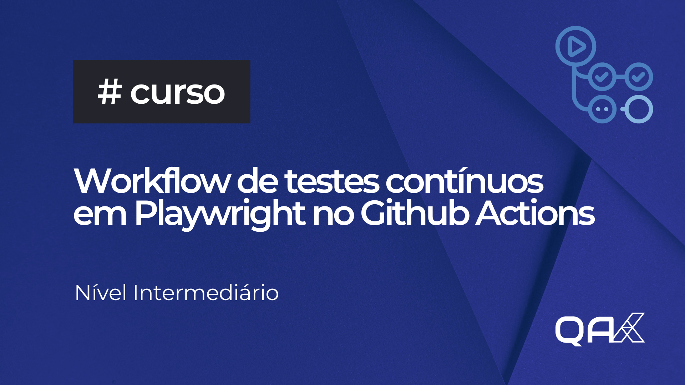

## Sobre

Repositório do treinamento: Workflow de testes contínuos em Playwright no Github Actions

## Stacks
- Playwright
- TypeScript
- Tesults

## Rodando

1. Clonar o repositório, instalar as dependências
```
npm install
```

2. Executar testes em Headless
```
npx playwright test 
```

3. Executar ver o relatório dos testes
```
npx playwright show-report
```

<hr>
Curso disponível em https://qaxperience.com

